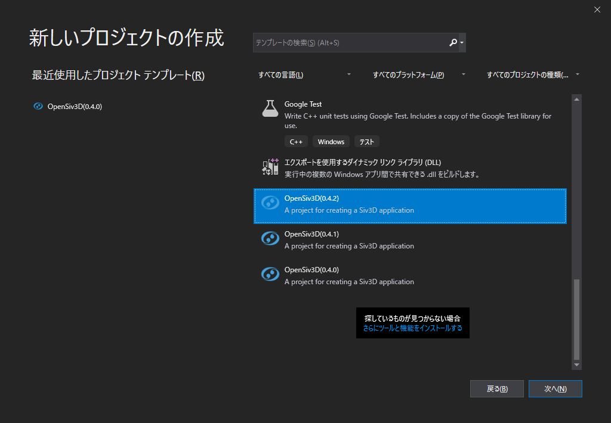
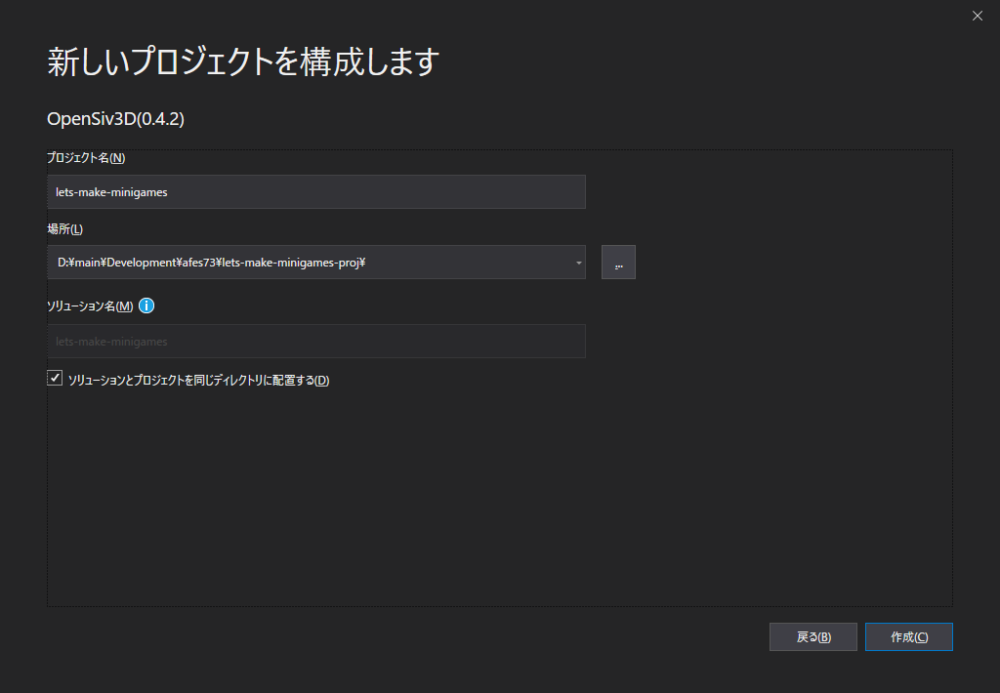
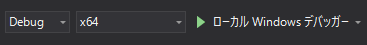
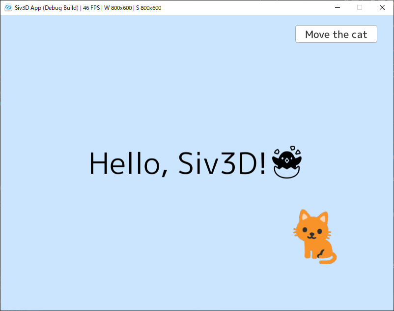
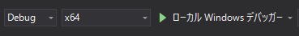

# 2.2 開発の準備

## 2.2.1 プロジェクトの作成

まずはプロジェクトを作ろう。
VS2019を起動し、新規プロジェクトの作成に進む。

画像のように`OpenSiv3D(0.4.2)`を選択したら、「次へ」。

プロジェクト名はご自由に。
今回なら講座用に`lets-make-minigames`とでもしておくのがいいのではなかろうか。

場所は自分でわかりやすい場所にするべき。あとから探すのは大変なので…
VisualStudioが用意してくれた場所(`~/source/repos/`)もある。そこを使うのもありかもしれない。

`ソリューションとプロジェクトを同じディレクトリに配置する` は、基本的にチェックを入れていいと思う。VisualStudioには`ソリューション`と`プロジェクト`という２つの概念があるが、ミニゲーム程度のプロジェクトなら分けて考える必要は無い。

決まったら「作成」。

なんと、~~DxLibと違い、~~ Siv3Dはこれだけでプロジェクトの作成が完了する。

ソリューションエクスプローラーから `Source Files` > `Main.cpp` を開いてみよう。
`void Main()`の中、`while (System::update())`が所謂メインループである。

今はここに書いてあるコードの意味がわからなくても、この講座を通してわかるようになるのが目標なので、ぜひ頑張ってほしい。

## 2.2.2 ビルド・実行

続いて、ビルド・実行する方法を見ていく。

ビルドは、ツールバーにあるこのボタンから行う。ショートカットキーは`F5`。実際に実行してみよう。

このようなウィンドウが出てくれば正解。出てこない場合は呼んでくれれば見に行く。

ウィンドウは❌か`ESC`で終了できる。

`Debug`というドロップダウンリストを開くと、他に`Release`という項目がある。`Release`でビルドすると、最大限の最適化が行われ、動作の軽量化やファイルサイズの縮小などが可能な一方、ブレークポイントなどのデバッグ用機能は使えなくなる。普段の開発時には`Debug`でビルドし、配布時などには`Release`でビルドするといいだろう。

ビルドされた結果は、`/Intermediate/(project名)/Debug|Relaease/(project名).exe`にある。現時点ではこのexe単体で動作する。画像とかはまた追々…
